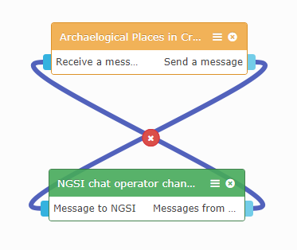

Introduction
------------
This is a modified version of initial widget "basic-chat" created by CoNWet Lab.

It has been configured to be used as default Chat Room in the implemented mashup "archaelogical places_Crete".

Settings (Preferences)
----------------------

1. Gravatar URL: You can specify your gravatar url account in order to be used by the chat widget ( https://gravatar.com/-your_gravatar_username- )                 

Wiring
------

1. Connect the input endpoint of the widget to the output endpoint of the operator "NGSI chat operator changed by timaris".
2. Connect the output endpoint of the widget to the input endpoint of the operator "NGSI chat operator changed by timaris".

For example:	

References
----------

* [FIWARE Lab's Data portal](https://data.lab.fiware.org)
* [WIRECLOUD Manual](https://wirecloud.readthedocs.io)
* [ORION BROKER Documentation](https://fiware-orion.readthedocs.io/en/develop/quick_start_guide/index.html)	
* [NGSI Documentation](http://fiware-orion.readthedocs.io/en/latest/user/walkthrough_apiv1/)
* [Github Repository of timaris](https://github.com/timaris/Wirecloud_Components/tree/master/basic-chat-arch.(by_tim)_2.0-widget)
* [Github Repository of CoNWet](https://github.com/wirecloud-fiware/quick-start-development-tutorial/tree/master/basic-chat)

Introduction of initial widget (CoNWet Lab)
-------------------------------------------
This is a widget created for demo and teaching purposes. Despite that, it has been designed to be fully functional.

It is an incrementally created chat application that incorporate most of basic wirecloud functionalities.

Initially a bare widget is created begining with an empty skeleton.

This basic widget is added some properties, where the user can indicate his own [gravatar.com](http://www.gravatar.com) profile. Further information about the user is gathered from his [gravatar.com](http://www.gravatar.com) profile, showing how to perform HTTP proxy-based requests.

Next, a basic chat functionality is implemented using wiring to send and receive _messages_ to other instance of the same widget. This allows showing how to use wiring, both for sending messages and for subscribing to them.

Finally, a fully functional chat application will be created making use of the Context Broker Generic Enabler (Orion Context Broker) integrated in FiLab to send and receive messages to/from other users. This widget will keep unmodified, but it will have access to the Context Broker through an operator, and the comunication with the operator will keep using wiring endpoints created in thie widget.
