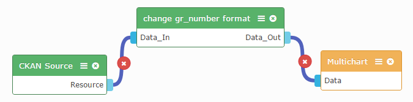

Introduction
------------

This operator allows you to feed any json dataset and convert the greek number format (e.g. 1.000,00) to global number format (e.g. 1000.00) .

Settings
--------

No specific settings needed.

Obtaining a resource
-----------------------

1. Connect to the input endpoint of the operator a dataset (json) .
2. Connect the output endpoint of the operator to another widget or operator you want to feed with the converted data.

For example: -))

References
----------

* [FIWARE Lab's Data portal](https://data.lab.fiware.org)
* [WIRECLOUD] (https://wirecloud.readthedocs.io)
* [CKAN] (http://ckan.org/)

