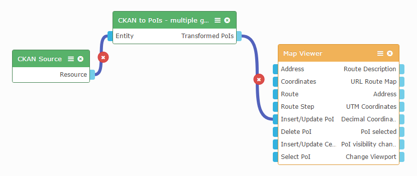

Introduction
------------

This operator transforms geo-data from a CKAN source to Points of Interest. It supports the coordinate systems: 1) Global used by Google Maps "EPSG:4326 - WGS84"  and
2) Greek System "EPSG:2100 - GGRS87" .
The sceleton of the code is based to the "ckan2poi" operator by CoNWet Lab.

Settings (Preferences)
----------------------

1. Coordinates attribute: Type the column/s of the input dataset that contain the coordinates. If the dataset provides the coordinates through a pair of columns,
                          you can pass those names using a comma (e.g. 'Latitude,Longitude') .
   
2. Marker Icon URL type : If you want to choose a marker icon different from the default one, you must define if the type is an Absolute Url or an Internal Url Source.
                          Type either 'absolute_url' or 'internal_url' . Leave empty for the default icon  .
						  
3. Marker Icon          : If you choose a parameter in 'Marker Icon URL type' , then you should type the url address. For internal source, the default path is 'images/.....'						  
						  
4. Coordinate System    : Define which coordinate system uses the input dataset. If empty, then it is the global system used by Google Maps "EPSG:4326 - WGS84" .
						  For Greek system used by many greek authorities, please type "GGRS87" , which refers to "EPSG:2100" .

Obtaining a resource and wiring
-------------------------------

1. Connect to the input endpoint of the operator a dataset(json) which contains column/s of coordinates.
2. Connect the output endpoint of the operator to a map widget (e.g. Map Viewer), where you want to feed the tranformed Points of Interest.

For example:	

Developing notes
----------------

If you are a developer and want to modify the function "convertCoordsToWGS84" in order to convert coordinates from another system than "EPSG:2100 - GGRS87" ,
you only need to change the variable "sourceProjection" with the desired system. You can find the code here in the url "https://epsg.io/" and copy the "Proj4js" definition.

References
----------

* [FIWARE Lab's Data portal](https://data.lab.fiware.org)
* [WIRECLOUD Manual](https://wirecloud.readthedocs.io)
* [CKAN Platform](http://ckan.org/)
* [Github Repository of timaris](https://github.com/timaris/Wirecloud_Components/tree/master/ckan2poi_WGS84_GGRS87_2.0-operator)
* [Github Repository of CoNWet](https://github.com/wirecloud-fiware/ckan2poi)
* [Proj4js Library](http://proj4js.org/)
* [Coordinate Systems Worldwide](https://epsg.io/)
* [Flaticon marker icons](http://www.flaticon.com/)

